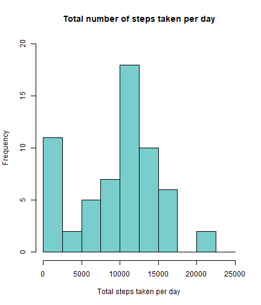
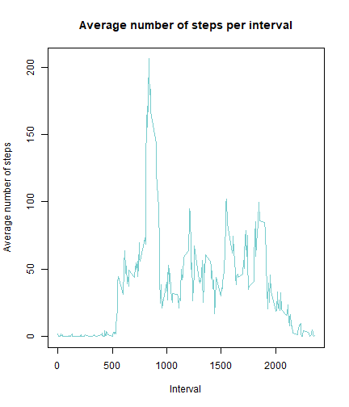
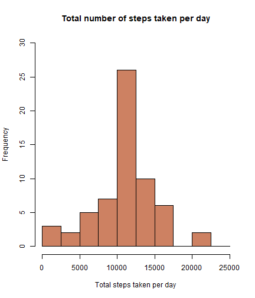

# INTRODUCTION

It is now possible to collect a large amount of data about personal movement using activity monitoring devices such as a Fitbit, Nike Fuelband, or Jawbone Up.\
These type of devices are part of the "quantified self" movement -- a group of enthusiasts who take measurements about themselves regularly to improve their health, to find patterns in their behavior, or because they are tech geeks. But these data remained under-utilized both because the raw data are hard to obtain and there is a lack of statistical methods and software for processing and interpreting the data.\
This report aims to provide useful insight about the potencial of these activity monitoring devices, analyzing data gathered through them.

# SOURCE AND VARIABLE

All data referenced in these report has been gathered from a personal activity monitoring device. This device collects data at 5 minute intervals through out the day.\
The data consists of two months of data from an anonymouse individual collected during the months of October and November, 2012 and include the number of steps taken in 5 minutes intervals each day.

The variables included in this dataset are: 

- steps: Number of steps taking in a 5-minute interval (missing values are coded as NA NA).

- date: The date on which the measurement was taken in YYYY-MM-DD format.

- interval: Identifier for the 5-minute interval in which measurement was taken.

The dataset is stored in a comma-separated-value (CSV) file and there are a total of 17,568 observations in this dataset.

# RESULTS

## Loading and preprocessing the data


```r
unzip("activity.zip")
data <- read.csv("activity.csv", header = T, sep = ",")

data$date <- as.Date(data$date,"%Y-%m-%d")

data$weekday <- weekdays(data$date)

summary(data)
```

```
##      steps             date               interval        weekday         
##  Min.   :  0.00   Min.   :2012-10-01   Min.   :   0.0   Length:17568      
##  1st Qu.:  0.00   1st Qu.:2012-10-16   1st Qu.: 588.8   Class :character  
##  Median :  0.00   Median :2012-10-31   Median :1177.5   Mode  :character  
##  Mean   : 37.38   Mean   :2012-10-31   Mean   :1177.5                     
##  3rd Qu.: 12.00   3rd Qu.:2012-11-15   3rd Qu.:1766.2                     
##  Max.   :806.00   Max.   :2012-11-30   Max.   :2355.0                     
##  NA's   :2304
```

## What is mean total number of steps taken per day?


```r
data.tsd <- aggregate(data$steps, 
                      by = list(data$date), 
                      FUN = sum, 
                      na.rm = TRUE)

names(data.tsd) <- c("date", "steps")

hist(
  data.tsd$steps,
  main = "Total number of steps taken per day",
  xlab = "Total steps taken per day",
  col = "#79CDCD",
  ylim = c(0,20),
  breaks = seq(0,25000, by = 2500)
)
```



```r
mean.tsd <- mean(data.tsd$steps)
median.tsd <- median(data.tsd$steps)
```

On average, the number of steps taken per day is 9354.2295082.\
Similarly, the median is equal to 10395

## What is the average daily activity pattern?


```r
data.dap <- aggregate(data$steps, 
                      by = list(data$interval),
                      FUN = mean,
                      na.rm = TRUE)

names(data.dap) <- c("interval", "mean")

plot(data.dap$interval, data.dap$mean,
     type = "l",
     xlab = "Interval",
     ylab = "Average number of steps",
     main = "Average number of steps per interval",
     col = "#79CDCD")
```



```r
max.dap <- data.dap[which.max(data.dap$mean),]$interval
```

On average across all the days in the dataset, the interval 835 contains the maximum number of steps.

## Imputing missing values


```r
totalNA <- sum(is.na(data$steps))
```

There are 2304 missing values in the data set. However, a method for filling in these missing values has been devised. The mean for the day is to be considered for this purpose.


```r
clean.steps <- data.dap$mean[match(data$interval,data.dap$interval)]

data$stepsClean <- ifelse(is.na(data$steps), yes = clean.steps, no = data$steps)

dataClean.tsd <- aggregate(data$stepsClean,
                           by = list(data$date),
                           FUN = sum)

names(dataClean.tsd) <- c("date", "steps")

hist(
  dataClean.tsd$steps,
  main = "Total number of steps taken per day",
  xlab = "Total steps taken per day",
  col = "#CD8162",
  ylim = c(0,30),
  breaks = seq(0,25000, by = 2500)
)
```



```r
meanClean.tsd <- mean(dataClean.tsd$steps)
medianClean.tsd <- median(dataClean.tsd$steps)
```

As a result, the average number of steps taken per day is 1.0766189 &times; 10<sup>4</sup>.\
Similarly, the median is equal to 1.0766189 &times; 10<sup>4</sup>

## Are there differences in activity patterns between weekdays and weekends?


```r
library(ggplot2)

data$wdtype <- ifelse(
  data$weekday == "sábado" | data$weekday == "domingo",
  yes = "Weekend",
  no = "Weekday")

data.wd <- aggregate(data$stepsClean,
                     list(data$wdtype, data$interval),
                     FUN = mean,
                     na.rm = TRUE)

names(data.wd) <- c("dateType", "interval", "steps")

ggplot(data.wd,
       aes(x = interval,
           y = steps,
           color = dateType)) +
  geom_line() +
  labs( title = "Average daily steps by date type",
        x = "Interval",
        y = "Average number of steps") +
  facet_wrap(~dateType, ncol = 1, nrow = 2)
```


As shown in the graph above, there are some differences in activity between weekdays and weekends. Most surprisingly, weekends appear to be more active. It might be due to long hours of desk-job during weekdays.
